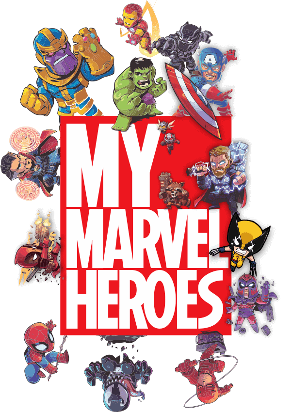

# My Marvel Heroes

iOS application developed from scratch during the Udacity Nanodegree iOS developer course.

The main idea of the project was designed by me, including features, interface, assets and navigation. The project was built from scratch and went through several stages until the final implementation, such as API research, core idea, creation of user interfaces, elicitation and validation of requirements with users. Each stage of development was supported by the Udacity team.

## Project Overview

App developed for Marvel Fans. **My Marvel Heroes** allows you to search and see all of Marvel's heroes including their description, comics, series, and stories. In addition, you can save your favorite heroes in a different list.

### [The Marvel Comics API](https://developer.marvel.com/)

**My Marvel Heroes** APP uses the Marvel API to retrieve all information about the heroes. The Marvel Comics API allows developers everywhere to access information about Marvel's vast library of comics—from what's coming up, to 70 years ago.

## Users guide

Navigation | Details | Search | Favorite
:-:|:-:|:-:|:-:
  |   |  |  

## Implementation Details

### Infinite scroll
The main screen of **My Marvel Heroes** shows an infinite scroll with all the heroes available in the Marvel API. Each API query returns 20 heroes.

### Cache
#### Problem
Every time a hero appeared by scrolling or searching, or even when the application went into the background, the hero's image was downloaded again and again.

#### Solution
**My Marvel Heroes** uses cache to save each hero image on scrolling and searching. After the first download, the image is cached and used whenever necessary, avoiding unnecessary downloads.

### Core Data
The user can make a list of their favorite heroes by touching the heart button. Favorite heroes are listed in the "Favorites" tab and saved locally by CoreData. The data of the favorite heroes that are listed in the "Marvel Heroes" tab are recovered through CoreData.

Marvel Heroes Tab | Favorites Tab
:-:|:-:
 | 

